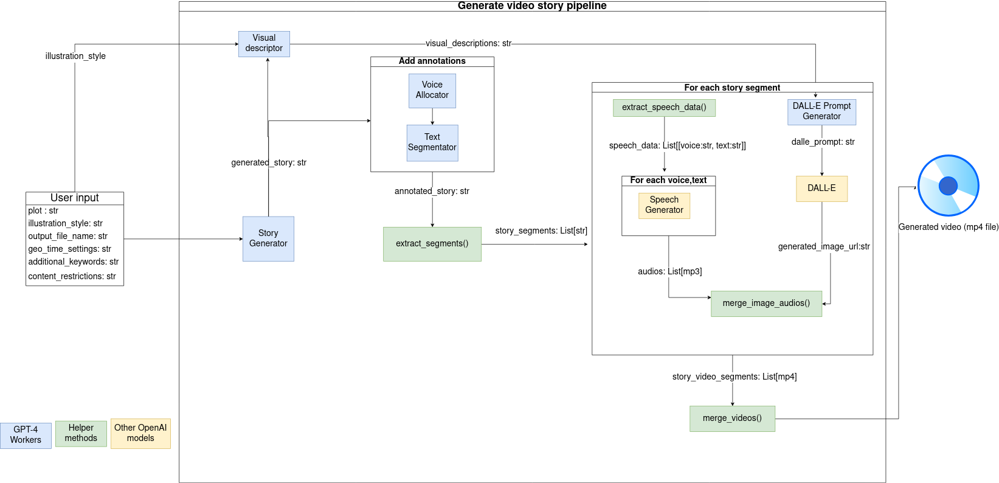

# plot2Video

A Python script that leverages OpenAI's API to generate a story and transform it into a video with only one command line.

## Overview
The project uses 5 **GPT-4** workers, each with a specific role and task. The GPT workers simulate an **editorial line** by performing tasks such as separating story in semantic segments, creating approriate and consistent visual descriptions, and assigning voices based on the current speaker. This ensures that the generated content is coherent and visually appealing.

Testing was conducted to determine the configuration of system prompts to set up the GPT-4 models as effective workers for automating the tasks correctly. This involved iterating on the prompts and refining the tasks (system prompt) assigned to each GPT worker.

In addition **DALL-E** is used for generating images and **OpenAI Text-to-Speech** is used for generating voiceovers for the characters and narrator in the story.

### OpenAI models and GPT-Workers
Below is a table summarizing the roles, tasks, inputs, and outputs of all the models used. Each row in the table where the model is labeled as `gpt-4o` indicates a specific designed GPT worker.

| Model                   | OpenAI model | Description                                                                                                                                                                                                                                                                                                  | Input(s)                                                                              | Output                                                                                                                                                                                                                                 |
|-------------------------|--------------|--------------------------------------------------------------------------------------------------------------------------------------------------------------------------------------------------------------------------------------------------------------------------------------------------------------|---------------------------------------------------------------------------------------|----------------------------------------------------------------------------------------------------------------------------------------------------------------------------------------------------------------------------------------|
| Story Generator         | gpt-4o       | Generate a story based on user input                                                                                                                                                                                                                                                                         | Plot <br> Geo-time context <br> Additional keywords <br> Content restriction                  | The generated story                                                                                                                                                                                                                    |
| Text Segmentator        | gpt-4o       | Splits the story into segments that can be illustrated, keeping the text intact and outputting the characters and places for each segment                                                                                                                                                                    | Story                                                                                 | Story <br> ```Segment1: [Text]  Characters: [List of characters involved]  Place: [Place where the segment takes place]    Segment2: [Text]  Characters: [List of characters involved] Place: [Place where the segment takes place]```|
| Voice allocator         | gpt-4o       | Enhances narration clarity by attributing each part of the text to the narrator or appropriate character, avoiding problematic characters like single quotes, double quotes, and backslashes. Identifies and attributes dialogue and narration, ensuring consistent voice assignment using predefined voices | Story                                                                                 | Story segments with voice attributions ``` Voice VoiceName: [text]  ```                                                                                                                                                                |
| Visual descriptor       | gpt-4o       | Provides detailed descriptions of characters and places, that will be used as references by the DALL-E Prompt Generator to ensure consistency in output images                                                                                                                                               | Full story                                                                            | Detailed visual descriptions of each character and place of the story                                                                                                                                                                  |
| DALL-E Prompt Generator | gpt-4o       | Constructs detailed prompts for DALL-E to visualize a specific segment of a story, capturing its essence, theme, and characters and using the provided character and place descriptions                                                                                                                      |  Segment of the story to illustrate <br>  Style <br>  Character and Place descriptions<br>  | DALL-E Prompt                                                                                                                                                                                                                          |
| Image generator         | dall-e-3     | Generates an image based on the given prompt                                                                                                                                                                                                                                                                 | DALL-E prompt                                                                         | generated image url                                                                                                                                                                                                                    |
| Speech generator        | tts-1        | Creates an audio speech from a text input and a voice                                                                                                                                                                                                                                                        |  Voice <br>  Text                                                                     | mp3 file                                                                                                                                                                                                                             |
### Pipeline 

## Usage

 You need to have the following :

1. **Python 3.7+**

2. **OpenAI API Key**: You need an API key from OpenAI to access GPT-4, DALL-E, and text-to-speech services.

To use the script, follow these steps:

1. **Install Requirements**: Install the required Python packages by running:

   ```bash
   pip install -r requirements.txt
   ```

2. **Set OpenAI API Key**: Set your OpenAI API key as an environment variable:

   ```bash
   export OPENAI_API_KEY=<your_api_key>
   ```

   Replace `<your_api_key>` with your actual OpenAI API key.

3. **Run the Script**: Execute the script with the following command:

   ```bash
   python3 -m generate_video_story [-h] --illustration_style ILLUSTRATION_STYLE --plot PLOT
                               [--geo_time_setting GEO_TIME_SETTING]
                               [--additional_keywords ADDITIONAL_KEYWORDS]
                               [--content_restrictions CONTENT_RESTRICTIONS]
                               --output_file_name OUTPUT_FILE_NAME

   A Python script that leverages OpenAI API to generate a story and transform it into a
   video with only one command line

   optional arguments:
   -h, --help            show this help message and exit
   --illustration_style ILLUSTRATION_STYLE
                           The style of the illustrations (e.g., anime, realistic, cartoon)
   --plot PLOT           A short description of the story
   --geo_time_setting GEO_TIME_SETTING
                           The geographical and temporal setting of the story (optional)
   --additional_keywords ADDITIONAL_KEYWORDS
                           Additional keywords for the story (optional)
   --content_restrictions CONTENT_RESTRICTIONS
                           Any content restrictions (optional)
   --output_file_name OUTPUT_FILE_NAME
                           The name of the output file
   ```

   **The output file will be located in `/work_folder`**
### Example:

```bash
python3 -m generate_video_story --illustration_style "cartoon" --plot "A gripping tale of adventure" --geo_time_setting "Medieval Europe" --additional_keywords "fantasy" --content_restrictions "PG-13" --output_file_name "output.mp4"
```

This command will execute the script with the provided parameters, generating the output file with the specified name.

## Example of generated videos

### Two dog kingdoms fight for the good boy prize (Style cartoon)

Obtained with : 
```bash
python3 -m generate_video_story --illustration_style "cartoon" --plot "Two dog kingdoms fight for the good boy prize"
```

[](https://youtu.be/sS4SgaWSegs)


### Cat Kingdom vs Dog Kingdom Competition for Best Pet

Obtained with : 
```bash
python3 -m generate_video_story  --illustration_style "cartoon" --plot "Cat Kingdom vs Dog Kingdom Competition for Best Pet" 
```

[](https://youtu.be/dyoK8szs8Ac)

### In a manga-style story, two characters fight to be recognized as the best assassin

Obtained with : 
```bash
python3 -m generate_video_story  ---illustration_style "manga" --plot "In manga style story, two characters fight to be recognized as the best assassin"
```

[](https://youtu.be/mdoSDfg-3Xg)

### The story of a dog and a cat who are best friends

Obtained with : 
```bash
python3 -m generate_video_story  --illustration_style "cartoon" --plot "The story of a dog and a cat who are best friends" 
```

[](https://youtu.be/_BFjjSHOuUo)

### Interaction between 3 policeman (a cat, a bird, a dog) in a boat

Obtained with : 
```bash
python3 -m generate_video_story  --illustration_style "cartoon" --plot "Interaction between 3 policeman (a cat, a bird, a dog)" --geo_time_setting "Boat" 
```

[](https://youtu.be/B8YuqrJNynA)
 

### Character shonnen cook dominates the world by feeding his enemies

Obtained with : 
```bash
python3 -m generate_video_story --illustration_style "manga" --plot "Character shonnen cook dominates the world by feeding his enemies" 
```

[](https://youtu.be/jkHLxaqSWhE )


## Disclaimers

I am not responsible for the generated content and your usage of it. This project is for showcasing skills on a resume and as a hobby. It is not intended for business purposes.

## Cost Consideration

Please note that the OpenAI API is a paid service. The cost of generating a video using this script can vary, typically ranging from $0.30 to $1 per video. This cost depends on the complexity and length of the video being generated.

## Important Note

Please be aware that sometimes the script may fail. Achieving deterministic behavior from the GPT-prompter is challenging, even with extensive work on prompting and setting random variables to null. Despite efforts, occasional failures may occur due to the inherent nature of the AI model.


